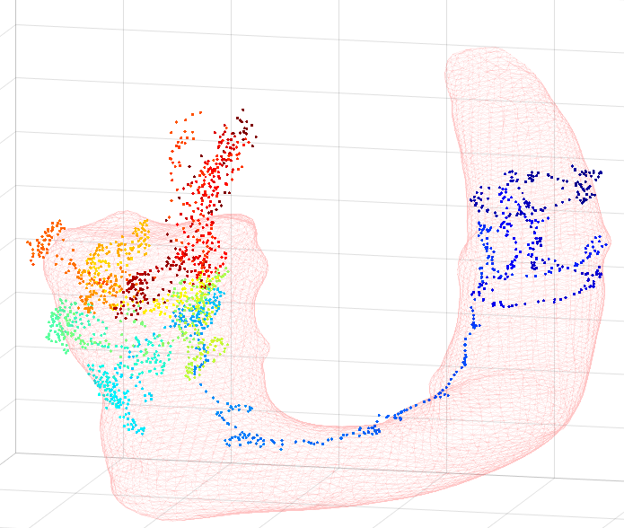
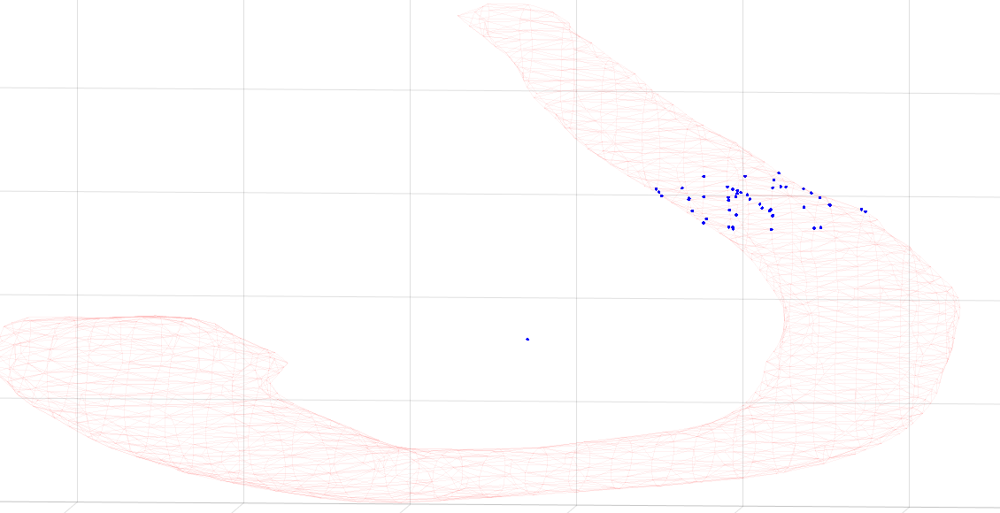
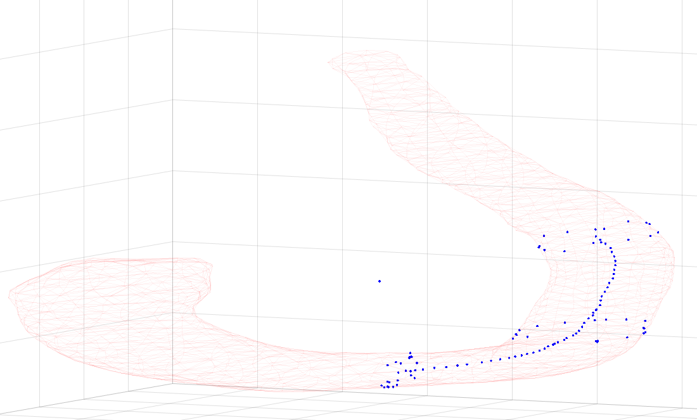
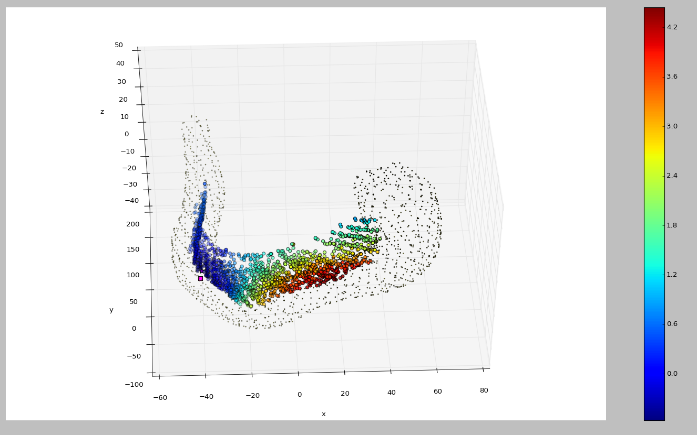
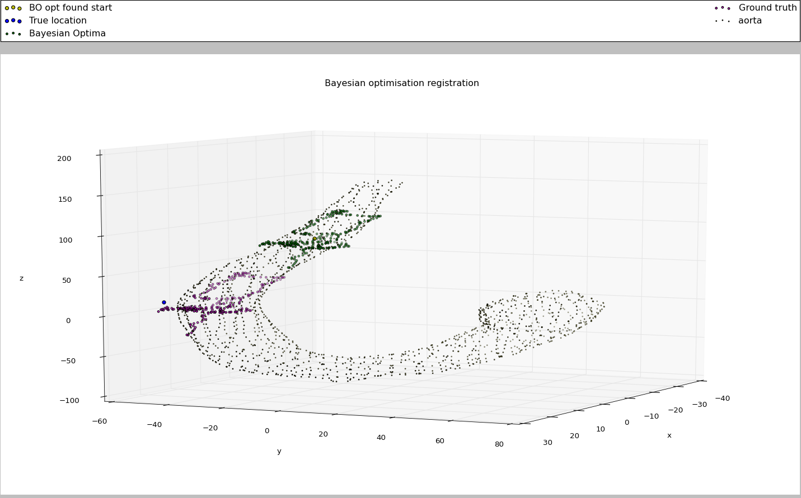
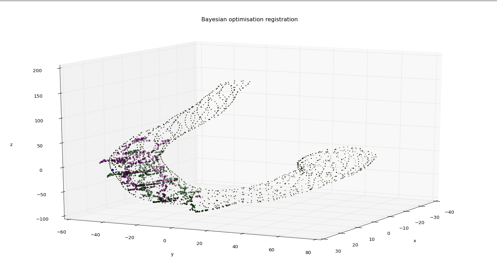

# MSc. Project Description
The aim is to localise a robotic surgical instrument within a patients aorta in real-time during a cardiac procedure. The instrument generates a point cloud describing the x,y,z locations that it has moved through but the coordinate axes are not intially aligned with the coordinate axes of the scan. Therefore the point cloud needs to be aligned with the point cloud of the scan.

The repositories show some of the code used in the project.

The plot below shows an example aorta and full trajectory with the colour of the trajectory showing the time the point was collected. During the procedure we will not have the full trajectory until the end. So registration is sequentially attempted and improved with subsets of increasing size.

The way the registration is attempted is using Bayesian optimisation. This means a surrogate model makes predictions as to the location that the registration would be successful over the entire possible space.

The space is defined by generating trajectories of various starting locations and lengths and finding the mean x,y,z coordinate of the trajectory in its optimal alignment. Example simulated trajectories are below.

This can be done cheaply and then the registration can actually be performed at the optimal location defined by the model. The error returned from this registration is then used to update the models predictions and find a new optimal location.

Below is an example plot of the resulting Bayesian optimisation prediction. The pink square is the true initial alignment position, and the colour goes from blue for lowest error to red maximum error.

The surrogate model learns appropriate locations to initialise the registration, as can be seen from the low error area (blue) being located near to the true location (pink square).

Below are two example registrations; the green points are the Bayesian optimisation registration and pink are the ground truth.

